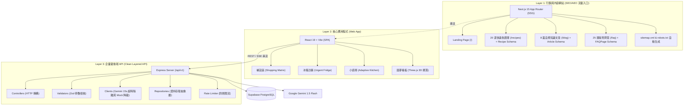

# CooCoo煮煮 🍲
> **都市單身套房租屋族的智慧自煮與圓夢儲蓄系統**  
> *Smart Self-Cooking & Dream Savings System for Urban Solo Renters*

[](https://coocoo-marketing.vercel.app)
[](https://nodejs.org)
[](https://nextjs.org)
[](https://react.dev)
[](https://aistudio.google.com)

---

## 📖 產品願景與解決痛點

台灣都市租屋族與外食族常面臨「下班意志力破產」、「外送費高昂每月破萬」、「套房無明火/抽油煙機難以開伙」、「買菜容易放到壞」四大核心困境。

**CooCoo煮煮** 結合 **物理學烹飪原理** 與 **精益庫存管理**，打造閉環自煮生態系：
1. 🛒 **精益採買**：對齊全聯/家樂福小份量規格，零剩食採購建議。
2. 🍱 **科學分裝**：滲透壓脫水與組織液阻斷，食材壽命延長 2~3 倍。
3. ⏱️ **15分鐘烹飪**：一鍋到底、設備自適應（快煮鍋/電鍋/電磁爐），洗滌件數 ≤ 2 件。
4. 💰 **圓夢儲蓄 (ROI Blocker)**：每餐即時計算外送差額，轉入 3D 撲滿願望清單。

---

## 🏗️ 系統架構圖 (Architecture Overview)



---

## 🚀 快速開始 (Local Development)

### 1. 專案目錄結構
```
stitch_coocoo_1.0_renew/
├── marketing-site/      # Next.js 15 SSG 行銷與知識庫網站 (Vercel 部署)
├── coocoo-webapp/       # React 19 + Three.js 核心應用程式
├── server/              # 模組化 Express 後端 API 服務 (Controllers, Repositories, AI Clients)
├── database/            # Supabase PostgreSQL Schema (schema.sql)
├── archive/             # 原型與探索資料封存區
└── docs/                # PRD 與產品架構設計規格文件
```

### 2. 啟動行銷網站 (Marketing Site)
```bash
cd marketing-site
npm install
npm run dev
# 瀏覽器打開：http://localhost:3000
```

### 3. 啟動核心 Web App
```bash
cd coocoo-webapp
npm install
npm run dev
# 瀏覽器打開：http://localhost:5173
```

### 4. 啟動後端 API 服務 (Backend Server)
```bash
cd server
npm install
cp .env.example .env
# 編輯 .env 填入 GEMINI_API_KEY (可使用 MOCK_GEMINI_KEY 本地離線測試)
npm run dev
# API 端點：http://localhost:5001/api/v1/health
```

---

## 🔌 API 端點列表 (V1 RESTful API)

| Method | Endpoint | 說明 | 參數驗證 (Zod) |
| :--- | :--- | :--- | :--- |
| `GET` | `/api/v1/health` | 伺服器健康狀態檢查 | - |
| `GET` | `/api/v1/inventory` | 取得目前冰箱庫存 | - |
| `POST` | `/api/v1/inventory` | 新增食材並自動計算科學防護規範 | `addInventorySchema` |
| `POST` | `/api/v1/recipes/generate` | AI 主廚生成 15 分鐘自適應食譜 | `generateRecipeSchema` |
| `POST` | `/api/v1/recipes/generate-stream` | SSE 串流式食譜生成 | `generateRecipeSchema` |
| `POST` | `/api/v1/shopping/assistant` | 智慧購物助手與重複食材比對 | `shoppingAssistantSchema` |
| `POST` | `/api/v1/ai/restock-analysis` | 每週庫存健康度與補貨矩陣診斷 | - |

---

## 🎨 莫蘭迪暖調色盤 (Morandi Color Tokens)

- **燕麥暖沙色 (Oatmeal Sand)**: `#F4F1DE` — 全域背景
- **暖心紅土色 (Terracotta)**: `#E07A5F` — 主品牌色
- **靜謐鼠尾草綠 (Sage Green)**: `#81B29A` — 安全與成功狀態
- **溫暖赭黃色 (Ochre Gold)**: `#F2CC8F` — 儲蓄與進度
- **深邃石板藍 (Slate Blue)**: `#3D405B` — 頂欄與深色強調
- **熟成柿橘色 (Rust Orange)**: `#D95D39` — 即期警告

---

## 📄 License
MIT © CooCoo煮煮 Team. All rights reserved.
