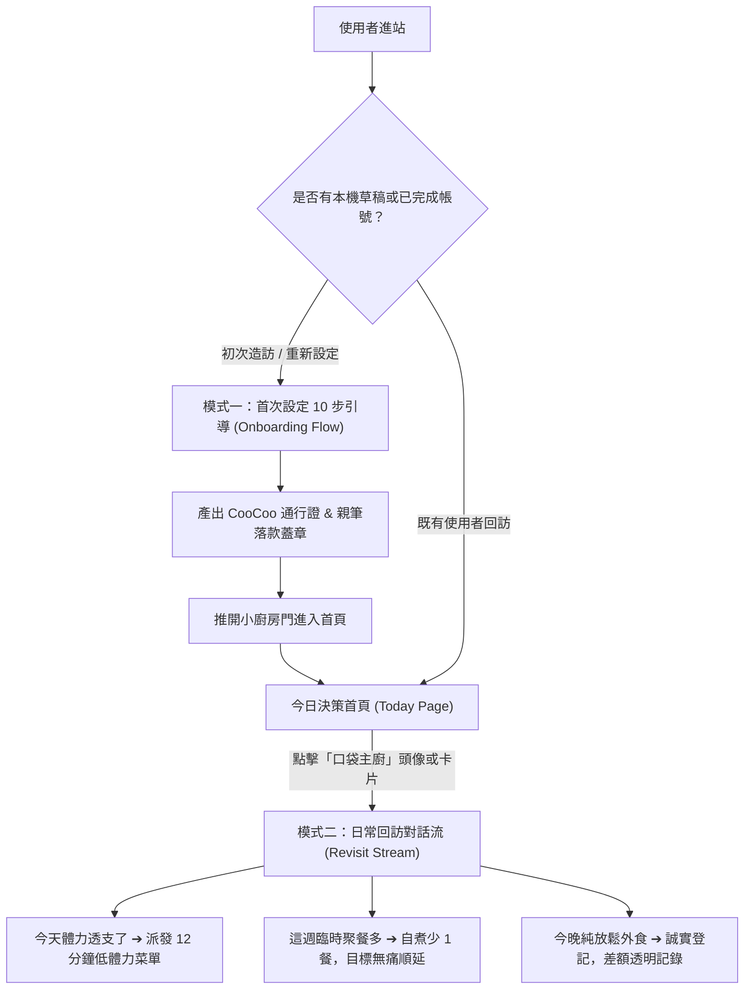

# CooCoo 主廚相談室（Chef Consultation）完整設計與技術規格書

> **文件版本**：v1.0 (Integrated MVP)
> **最後更新**：2026-09-06
> **適用範圍**：前端 `apps/web`、後端 `apps/api`、合約 `packages/contracts`、互動沙盒原型
> **狀態**：已通過沙盒全功能驗證與 Headless Chrome 動態驗收，待移植正式站

---

## 📖 目錄
1. [產品定位與核心原則](#1-產品定位與核心原則)
2. [雙模式架構（首次引導 ＋ 日常回訪）](#2-雙模式架構首次引導--日常回訪)
3. [首次設定 10 步驟詳細規格](#3-首次設定-10-步驟詳細規格)
4. [後端資料契約與 API 規格](#4-後端資料契約與-api-規格)
5. [UI 視覺系統與元件規範](#5-ui-視覺系統與元件規範)
6. [動態互動設計與參數標準](#6-動態互動設計與參數標準)
7. [瀏覽器自動化驗收清單](#7-瀏覽器自動化驗收清單)
8. [新手接關與下階段執行指南](#8-新手接關與下階段執行指南)

---

## 1. 產品定位與核心原則

### 1.1 角色定位
- **主廚名稱**：全站統一為 **「CooCoo」**（極具親和力、溫暖且專業的口袋主廚）。
- **角色語調**：
  - 同理租屋族與小資族的疲憊（「下班辛苦了！」）。
  - 務實、不說教、不道德綁架、嚴格保護飲食安全。
  - 倡導「先讓目標小到真的做得到」，自煮不是全有全無的極端挑戰。

### 1.2 不可違反的產品硬規則（Non-Negotiable Invariants）
1. **飲食限制為最高防線**：過敏原（甲殼類、堅果、蛋等）與禁食（全素、不吃牛）為硬限制，任何菜單推薦絕不以偏好或節省為由放寬。
2. **生活彈性第一**：臨時加班或疲憊想少煮 1 餐，目標自動順延，圓夢累積金不扣除、不計算為失敗、無任何懲罰。
3. **金錢差額實質轉化**：省下金額 = `外食比較價 - 自煮食材成本`（低標為 0），累積差額直接與使用者的「圓夢計畫」掛鉤。
4. **全程嚴禁 Emoji**：全站介面與相談室**一律嚴格使用 100% 向量 SVG 圖示**，確保專業、簡約現代感。

---

## 2. 雙模式架構（首次引導 ＋ 日常回訪）

主廚相談室並非「填完即丟」的一次性問卷，而是具備連續性的雙向入口：



---

## 3. 首次設定 10 步驟詳細規格

| 步驟 | 步驟標題 | 核心功能與互動重點 | 對應後端欄位 |
| :--- | :--- | :--- | :--- |
| **01** | **相談室開場** | 主廚 CooCoo 暖心自我介紹；說明填寫耗時約 3–5 分鐘；承諾本機草稿隨時自動暫存（關閉不遺失）。 | `status: "draft"` |
| **02** | **料理份量** | 選擇常用份量（1–12 人份，預設 1 人份）。提示：單身族煮 2 人份自動將多煮份數計入「熟食庫存」，不先算作已吃。 | `householdServings` |
| **03** | **小廚房裝備** | 勾選既有廚具（電鍋、微波爐、瓦斯爐、氣炸鍋...）；**支援「其他廚具」文字欄位（上限 40 字）**；下方即時動態渲染 **「裝備適配度解鎖雷達」**（如：已解鎖 14 道料理包）。 | `cookware`, `hasCustomCookware`, `customCookwareName` |
| **04** | **飲食限制與口味** | 頂部硬限制多選（甲殼類、花生、蛋、麩質、全素等）；下方自由輸入口味偏好標籤（如：清爽、香麻、少油）並可即時增刪。 | `restrictions`, `preferredFlavors` |
| **05** | **食材盤點** | 詢問「家裡現在是否有現成食材」；提供「完全沒有，從零買起」與「已有部分食材」二分切換，為冰箱庫存打底。 | `inventoryReviewed`, `hasNoInventory` |
| **06** | **餐費預算與餐期** | 設定每日餐費預算（預設 NT$ 240）；勾選預計自煮餐期（早餐、午餐、晚餐）；即時推算外食平均比對價。 | `dailyMealBudget`, `plannedMealSlots`, `outsideMealComparisonPrice` |
| **07** | **自煮目標** | 透過 `[- 3 +]` 微調每週目標餐數（1–21 餐）；下方貼心文案：「自由增減每週目標餐數，臨時不煮自動順延無壓力」（已移除不必要的加錢浮水印）。 | `weeklyHomeCookTarget` |
| **08** | **圓夢目標** | 輸入願望名稱（如：冬天去北海道看初雪）與目標金額（如：NT$ 30,000）；卡片即時推算「每週省下金額 ➔ 約幾週可實現願望」。 | `dreamName`, `dreamTargetAmount` |
| **09** | **登入同步** | 提供受邀 Email 驗證或 Google OAuth 快捷登入；將本機草稿無縫同步至雲端資料庫。 | `authEmail`, `authVerified` |
| **10** | **圓夢通行證蓋章** | 展現復古車票質感通行證（Dream Passport）；**CooCoo 雪松維爾草書由左至右真筆跡簽名 ＋ 橘色落款底線 ＋ 衝擊波重擊印章 ＋ 3D 推門進入廚房**。 | `isStamped: true`, `completedAt` |

---

## 4. 後端資料契約與 API 規格

### 4.1 TypeScript 契約（TypeBox Schema）
位於 `packages/contracts/src/index.ts`：

```typescript
export const OnboardingProfileSchema = Type.Object({
  status: Type.Union([Type.Literal("draft"), Type.Literal("complete")]),
  currentStep: Type.Integer({ minimum: 1, maximum: 10 }),
  householdServings: Type.Integer({ minimum: 1, maximum: 12 }),
  cookware: Type.Array(Type.Object({
    type: Type.String({ minLength: 1 }),
    capacity: Type.Optional(Type.String()),
    limitations: Type.Array(Type.String()),
  })),
  restrictions: Type.Array(DietaryRestrictionSchema), // 花生, 堅果, 蛋, 牛奶, 甲殼類, 魚, 麩質, 不吃牛, 全素
  preferredFlavors: Type.Array(Type.String()),
  inventoryReviewed: Type.Boolean(),
  hasNoInventory: Type.Boolean(),
  dailyMealBudget: MoneySchema, // 整數 TWD
  outsideMealComparisonPrice: MoneySchema,
  plannedMealSlots: Type.Array(MealSlotSchema, { minItems: 1 }), // breakfast, lunch, dinner
  weeklyHomeCookTarget: Type.Integer({ minimum: 1, maximum: 21 }),
  dreamName: Type.String({ minLength: 1 }),
  dreamTargetAmount: MoneySchema,
  completedAt: Type.Union([IsoDateTimeSchema, Type.Null()]),
});
```

### 4.2 本機暫存草稿機制
- **Storage Key**：`localStorage.getItem("coocoo:onboarding-draft:v1")`
- **防禦機制**：每次狀態變更立即寫入 LocalStorage，使用者不慎重整或關閉分頁，進站自動從 `currentStep` 恢復。

### 4.3 後端 API 端點
- `GET /api/v1/onboarding`：取得當前使用者的相談室資料草稿或完成檔。
- `POST /api/v1/onboarding`：儲存或提交相談室資料（更新 profile 並初始化 `goals` 與 `inventory`）。
- `POST /api/v1/goals`：建立圓夢計畫目標。
- `GET /api/v1/meal-decisions/today`：回訪時取得主廚今日推薦與即期食材狀態。

---

## 5. UI 視覺系統與元件規範

### 5.1 顏色體系（Tailwind CSS）
- **溫暖琥珀主色（Amber）**：`bg-amber-600`, `text-amber-950`, `border-amber-300`, `bg-amber-50`（營造廚房暖光與主廚親和感）。
- **沈穩大地灰底（Stone）**：`bg-stone-100`, `text-stone-900`, `border-stone-200`（避免冷冰冰的科技灰）。
- **圓夢與成果綠（Emerald）**：`bg-emerald-600`, `text-emerald-900`, `border-emerald-200`（用於雷達解鎖、省錢計算與安全認證）。
- **最高防線警戒紅（Red）**：`bg-red-50`, `text-red-900`（過敏原專屬標籤）。

### 5.2 字體排印（Typography）
- **主要介面文字**：系統預設無襯線字體（Inter / PingFang TC / -apple-system）。
- **數字統計與金額**：`font-mono-num`（等寬數字，避免排版數字跳動）。
- **主廚專屬落款簽名**：`Cedarville Cursive`（雪松維爾草書，流暢手寫感）。

### 5.3 100% 向量圖示（Zero Emoji）
全介面所有圖示皆採用手繪風格的 SVG 線條（stroke-width: 2 ~ 2.5），例如：
- 鍋鏟刀叉（主廚象徵）：`<path d="M18 2v6..."/>`
- 解鎖雷達：脈衝綠點 `<span class="animate-ping">` ＋ 盾牌打勾圖示。
- 簽名重播：`<polyline points="1 4 1 10 7 10"/>`。

---

## 6. 動態互動設計與參數標準

經過多次迭代與 UX 優化，所有動態效果均遵循「**溫和、精緻、克制、無干擾**」原則：

### 6.1 步驟轉場動態（Slide In Down）
- **CSS 類別**：`.step-slide-down`
- **動畫關鍵影格**：
  ```css
  @keyframes slideInDown {
    0% { opacity: 0; transform: translateY(-16px); }
    100% { opacity: 1; transform: translateY(0); }
  }
  .step-slide-down {
    animation: slideInDown 0.32s cubic-bezier(0.16, 1, 0.3, 1) forwards;
  }
  ```
- **核心特點**：移除了傳統彈簧的回彈與縮放（Zero Scale Overshoot），平滑向下就位。

### 6.2 步驟內防重起動態機制（Anti-Restart on Mutation）
- **問題成因**：以前只要點擊多選或按鈕，重新 re-render 時會整張卡片重新 slide-in，造成嚴重視覺閃爍。
- **解耦邏輯**：
  ```javascript
  const isStepChange = (lastRenderedStep !== currentStep);
  lastRenderedStep = currentStep;
  const animClass = isStepChange ? 'step-slide-down' : '';
  ```
- **效果保證**：只有切換步驟時才播放進場動畫；在同一步驟內點擊多選廚具、加減人數時，外層容器計算樣式為 `animation: none`，原地即時響應。

### 6.3 主廚擬真微表情反應（Living Chef Avatar）
- **常態呼吸感**：每 4.2 秒自然眨眼一次（`chefBlink`）。
- **互動反饋**：點擊選項時主廚輕微點頭認同（`chefNod: rotate(-8deg) -> rotate(5deg)`，0.55s）。
- **情緒標籤切換**：
  - 預設：「聆聽日常」（Amber）
  - 點選廚具/目標：「CooCoo 給讚！」（Emerald）
  - 點選過敏原：「最高防線確認」（Red）
  - 最終蓋章：「立約見證完成」（Deep Amber）

### 6.4 Cedarville Cursive 親筆真筆跡動態
- **墨道向量遮罩（SVG Continuous Stroke Mask Trajectory）**：
  - 依序沿著 `C` -> `o` -> `o` -> `C` -> `o` -> `o` 的草書圓環筆路行筆。
  - `stroke-dasharray: 620`，耗時 1400ms 均勻吐墨綻放。
  - **純墨水呈現**：不繪製漂浮筆桿或筆頭，專注於墨水流動感。
- **橘色落款底線揮毫（Liquid Orange Flourish Sweep）**：
  - 筆跡主體完成後 50ms，橘色漸層曲線（`#ea580c` -> `#f97316`）由左至右 0.42s 流暢劃過。
  - 預留充足 viewBox（`240 x 88`），大寫 `C` 頂部 100% 完整舒展不被截斷。

### 6.5 衝擊波重擊印章（Heavy Stamp Drop + Radial Shockwave）
- **蓋章下落**：`heavyStampDrop` 自 3.2 倍縮放迅速砸下，伴隨 -4 度自然傾斜。
- **空氣擴散環**：紅金色光環自中心擴散至 2.6 倍並消散（`shockwaveRing`，0.5s）。
- **觸覺回饋**：支援手機端振動 `navigator.vibrate([25, 45, 30])`。

---

## 7. 瀏覽器自動化驗收清單

本沙盒規格已由 **Google Chrome Headless** 完成無頭自動化測試，驗證結果如下：

| 驗收項目 | 測試動作 | 驗收條件 | 測試結果 |
| :--- | :--- | :--- | :--- |
| **Phase 1** | 切換步驟（如 Jump to Step 2） | 容器套用 `step-slide-down`，位移為上至下，無 scale 縮放 | **PASSED (slideInDown)** |
| **Phase 2** | Step 2 點擊人數 ＋ 按鈕 | 份量變為 2，容器計算樣式為 `animation: none`，無動畫重啟 | **PASSED (none)** |
| **Phase 2** | Step 3 點擊廚具多選與其他廚具 | 選項立即勾選，雷達數字更新，容器無重啟動畫 | **PASSED (none)** |
| **Phase 2** | Step 4 點擊過敏原選項 | 過敏標籤切換，觸發「最高防線確認」，容器無重啟動畫 | **PASSED (none)** |
| **Phase 3** | Step 7 點擊目標餐數 ＋ 按鈕 | 目標由 3 增至 4，`.coin-float` 節點為 0，無加錢浮動字樣 | **PASSED (Count: 0)** |
| **Phase 4** | Step 10 播放草書親簽動畫 | 大寫 C 頂部無裁切，筆順由左至右，橘色底線流暢劃過 | **PASSED (Verified)** |

---

## 8. 新手接關與下階段執行指南

> [!TIP]
> **給使用者的專業建議：**
> 這是非常成功的 MVP 原型設計！現在我們已經擁有了：
> 1. 一份完整的規格說明書（本文件）。
> 2. 一個可以隨時用瀏覽器打開體驗的獨立沙盒網頁（[`chef_consultation_merged_workflow.html`](file:///Users/kelly/.gemini/antigravity/brain/00ac4f47-1f53-4d9a-8e9e-f1a3c6e6e844/chef_consultation_merged_workflow.html)）。
> 3. 正式網站代碼完全乾淨無污染（`git status` 零異動）。

### 8.1 建議留存之核心檔案清單
當你開啟新的對話框時，請確保以下檔案在專案中：
1. **規格書**：`docs/CHEF_CONSULTATION_SPEC.md`。
2. **沙盒網頁**：`chef_consultation_merged_workflow.html`。
3. **走查與截圖記錄**：`walkthrough.md`。

---

### 8.2 新對話框「一鍵複製接關 Prompt」
當你在新對話框開始時，直接把下面這段話複製貼給 AI，他就能 100% 無縫接軌：

```markdown
你好！我是 CooCoo 專案的負責人。
我們剛剛在沙盒中完成了「主廚相談室（Chef Consultation）」的完整原型與動態設計，並通過了 Headless Chrome 的全功能驗收。

請你先閱讀以下檔案以獲取完整脈絡：
1. `CONTEXT.md`（產品術語與不可違反規則）
2. `docs/CHEF_CONSULTATION_SPEC.md`（主廚相談室完整規格書，包含 10 步流程、雙模式架構、後端契約與動態參數）
3. `docs/PROJECT_HANDOFF.md`（當前整合進度）

我們下一步的目標是：
將沙盒中驗收通過的「主廚 CooCoo 相談室（10 步引導、日常回訪流、Slide-in-Down 轉場、無重起動態、Cedarville Cursive 親簽落款）」正式移植至前端專案（`apps/web/src/pages/onboarding` 與首頁回訪入口）。

請依照專業的工程分步流程，先向我說明移植計畫，待我核准後再開始執行！
```
